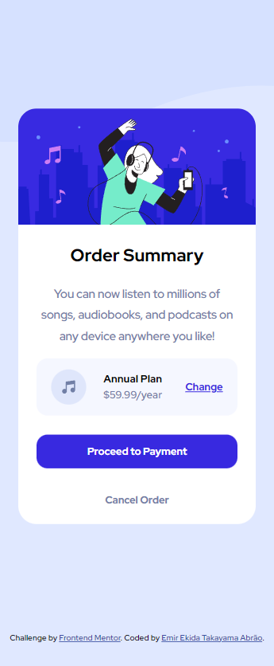

# Frontend Mentor - Order summary card solution

This is a solution to the [Order summary card challenge on Frontend Mentor](https://www.frontendmentor.io/challenges/order-summary-component-QlPmajDUj). Frontend Mentor challenges help you improve your coding skills by building realistic projects. 

## Table of contents

- [Overview](#overview)
  - [The challenge](#the-challenge)
  - [Screenshot](#screenshot)
  - [Links](#links)
- [My process](#my-process)
  - [Built with](#built-with)
  - [What I learned](#what-i-learned)
- [Author](#author)

## Overview

### The challenge

Users should be able to:

- See hover states for interactive elements

### Screenshot

### Links

- Solution URL: [https://www.frontendmentor.io/solutions/responsive-page-grid-and-flex-Glyj23GMM1](https://www.frontendmentor.io/solutions/responsive-page-grid-and-flex-Glyj23GMM1)
- Live Site URL: [https://swaveng.github.io/order-summary-component-main/](https://swaveng.github.io/order-summary-component-main/)

## My process

### Built with

- Semantic HTML5 markup
- CSS custom properties
- Flexbox
- CSS Grid
- Mobile-first workflow

### What I learned
  Better practice of flex and grid
## Author

- Website - [Emir Ekida Takayama Abrão](https://linktr.ee/emirng)
- Frontend Mentor - [@ngemir](https://www.frontendmentor.io/profile/ngemir)
- Twitter - [@NgEmir_](https://twitter.com/NgEmir_)
